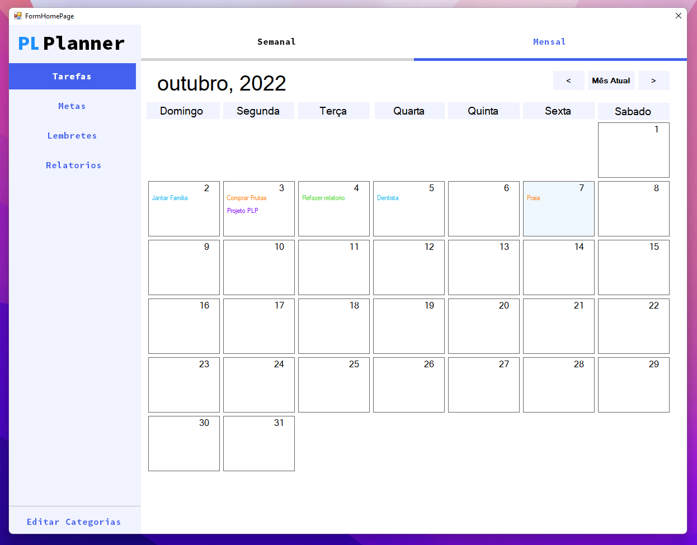
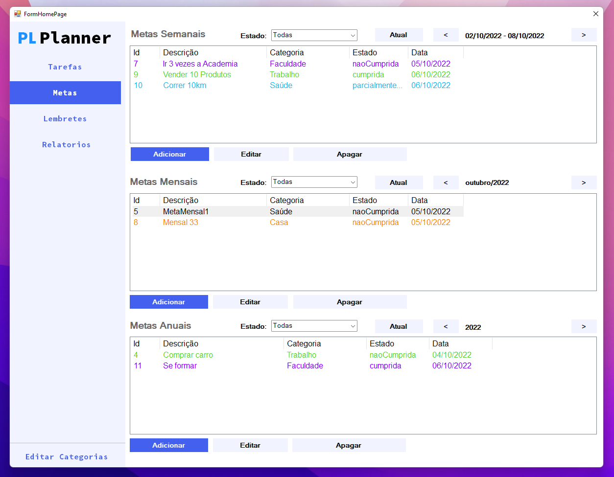
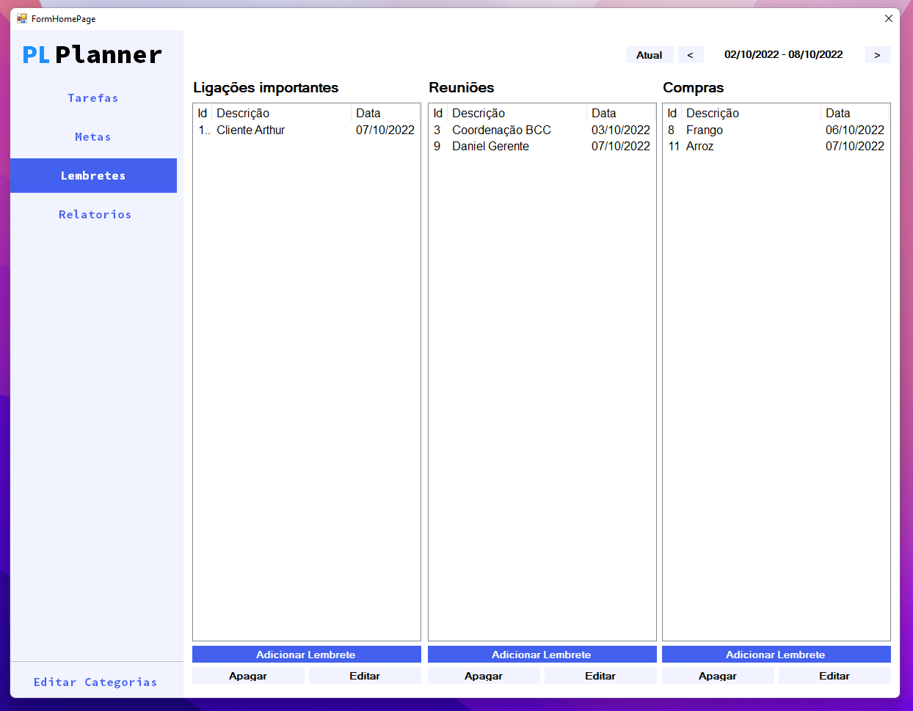
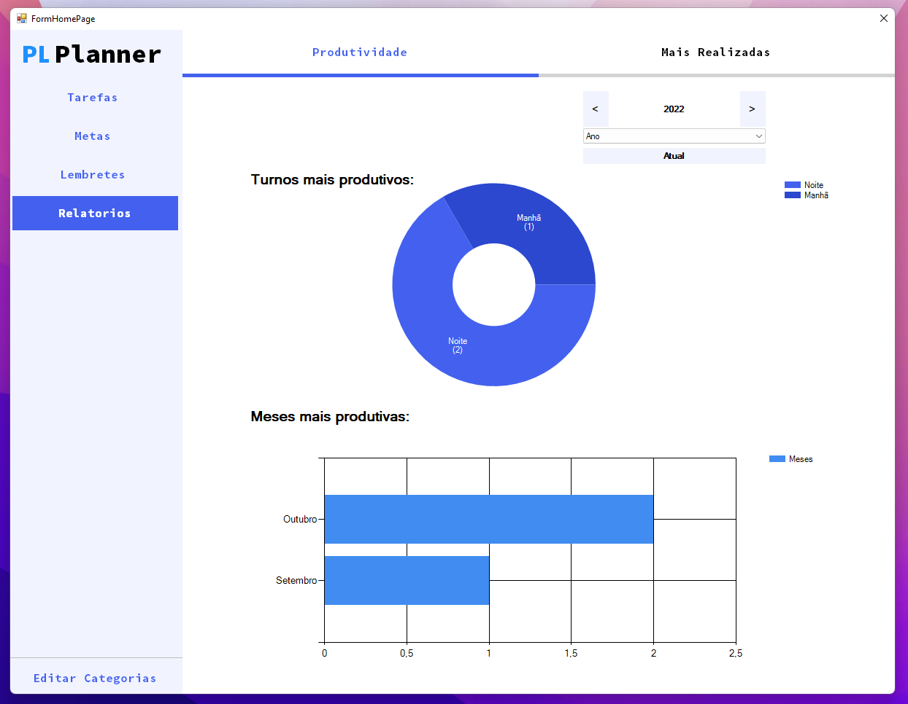
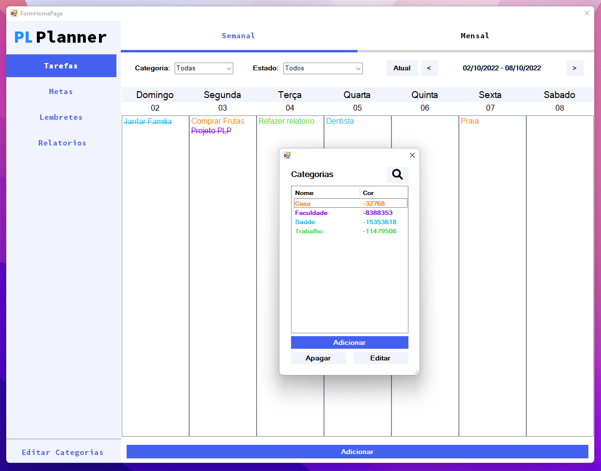

# PlannerVirtual

Projeto da disciplina de Paradigmas de Linguagens de Programação, mp período 2021.2, pela Universidade Federal do Agreste de Pernambuco(UFAPE) e ministrada pelo Professor Dimas Cassimiro do Nascimento Filho.

<ul>
  <li>Linguagem: VB.NET</li>
  <li>Banco de dados: SQLite</li>
</ul>

## :octocat: Integrantes
[José Daniel](https://github.com/JoseDanielF) | [Alex Silva](https://github.com/alexlsilva7) | [Arthur Costa](https://github.com/arthur007110) | [Antonio Bezerra](https://github.com/antoniobezerra01)

[Seminário da disciplina - VB.NET](https://docs.google.com/presentation/d/1mX0Z8jHYbHwVVwIjJqaigPR8WRa3fG769xTW_1oKz04/edit?pli=1#slide=id.gc6f980f91_0_0)

## Requisitos

Metas
<ul>
  <li>Criar metas para a semana, mês, e ano;</li>
  <li>Selecionar as metas que foram atingidas com sucesso, sem sucesso ou parcialmente atingidas;</li>
  <li>Uma meta possui uma descrição e uma categoria;</li>
</ul>
Planejamento de Atividades
<ul>
  <li>Criar um planejamento de atividades para um dia específico, permitindo a especificação de tarefas para blocos de meia hora, uma hora ou um turno do dia;</li>
  <li>Uma tarefa possui uma descrição e uma categoria;</li>
  <li>Marcar as tarefas como executadas, parcialmente executadas ou adiadas;</li>
  <li>Destacar tarefas e metas por categoria (exemplo, tarefas da mesma categoria são mostradas com a mesma cor);</li>
  <li>Criar lembretes semanais para realizar tarefas de: 
    <ul>
      <li>Ligações importantes;</li>
      <li>Reuniões; </li>
      <li>Compras;</li>
    </ul></li>
</ul>
Relatórios - Gerar relatórios semanais, mensais ou anuais, especificando:
<ul>
  <li>Quantidade e porcentagem de metas cumpridas;</li>
  <li>Quantidade e porcentagem de tarefas executadas;</li>
  <li>Destacar as semanas e meses mais produtivos;</li>
  <li>Destacar os turnos mais produtivos;</li>
  <li>Quais as categorias de tarefa mais realizadas;</li>
  <li>Quais as categorias de metas mais realizadas;</li>
</ul>

Persistencia
  <ul>
    <li>Os dados salvos pelo usuário devem ser armazenados de maneira persistente (arquivos ou banco de dados).</li>
  </ul>

## Imagens do sistema

